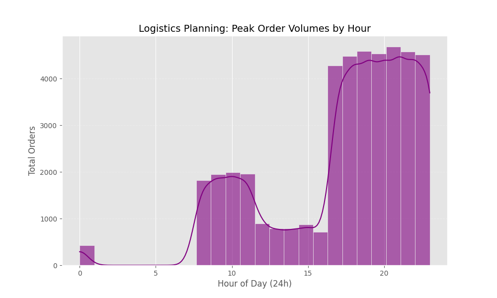
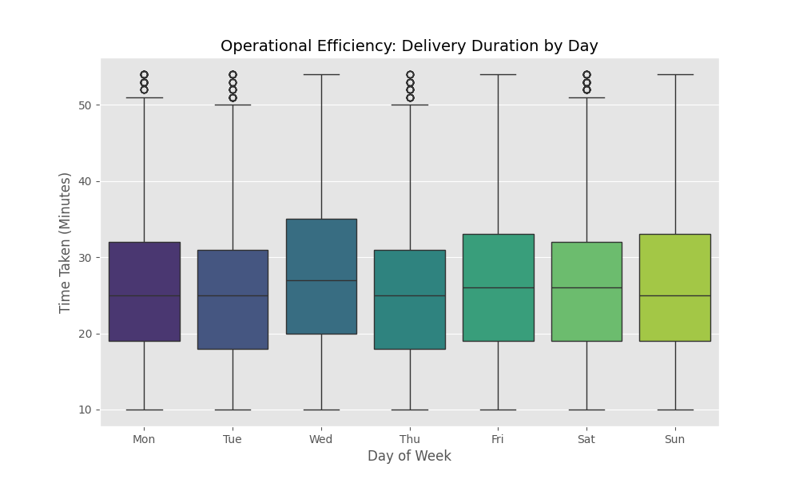
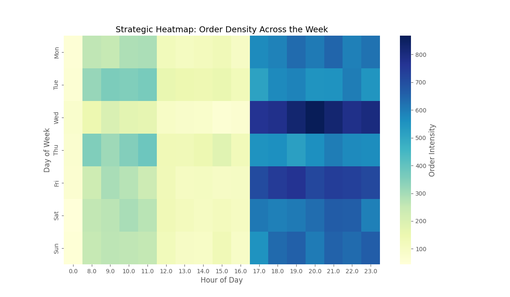

# 🍔 Food Delivery Demand Forecasting & Logistics Optimization

A predictive analytics framework designed to optimize delivery lead times by quantifying the impact of temporal surges and operational bottlenecks. 

## 📌 Executive Summary
Accurate delivery forecasting is critical for customer retention and operational efficiency in the hyper-local delivery space. This project utilizes a **Random Forest Regressor** to predict delivery durations (`Time_taken(min)`) by isolating high-intensity temporal blocks. 

The analysis reveals that **temporal factors** (hour of day) account for over 87% of delivery time variability, highlighting the need for dynamic logistics planning during peak blocks.

## 📊 Operational Insights

| Logistics Intelligence | Delivery Efficiency |
| :---: | :---: |
|  |  |
| *Isolating peak operational blocks for capacity planning* | *Analyzing day-wise variance in delivery performance* |

### Strategic Heatmap: Order Intensity
The heatmap below identifies the "Golden Hours" of delivery intensity across the week, providing a roadmap for driver shift optimization.

## 🚀 Methodology & Approach
- **Feature Engineering:** Extraction of high-granularity temporal features (`hour`, `day`, `weekend`) from raw order timestamps.
- **Predictive Modeling:** Implemented a **Random Forest Regressor** to capture non-linear relationships between peak hours and driver transit times.
- **Root Cause Analysis:** Utilized feature importance rankings to identify that 87.1% of delivery delays are hour-dependent, suggesting a shift from distance-based to demand-based logistics.

## 🛠️ Performance Metrics
- **Mean Absolute Error (MAE):** 6.69 minutes
- **Feature Weights:** `Hour` (87%), `Day` (6%), `Month` (6%).

---
*Note: This project serves as a strategic template for demand forecasting and logistics optimization in urban delivery networks.*